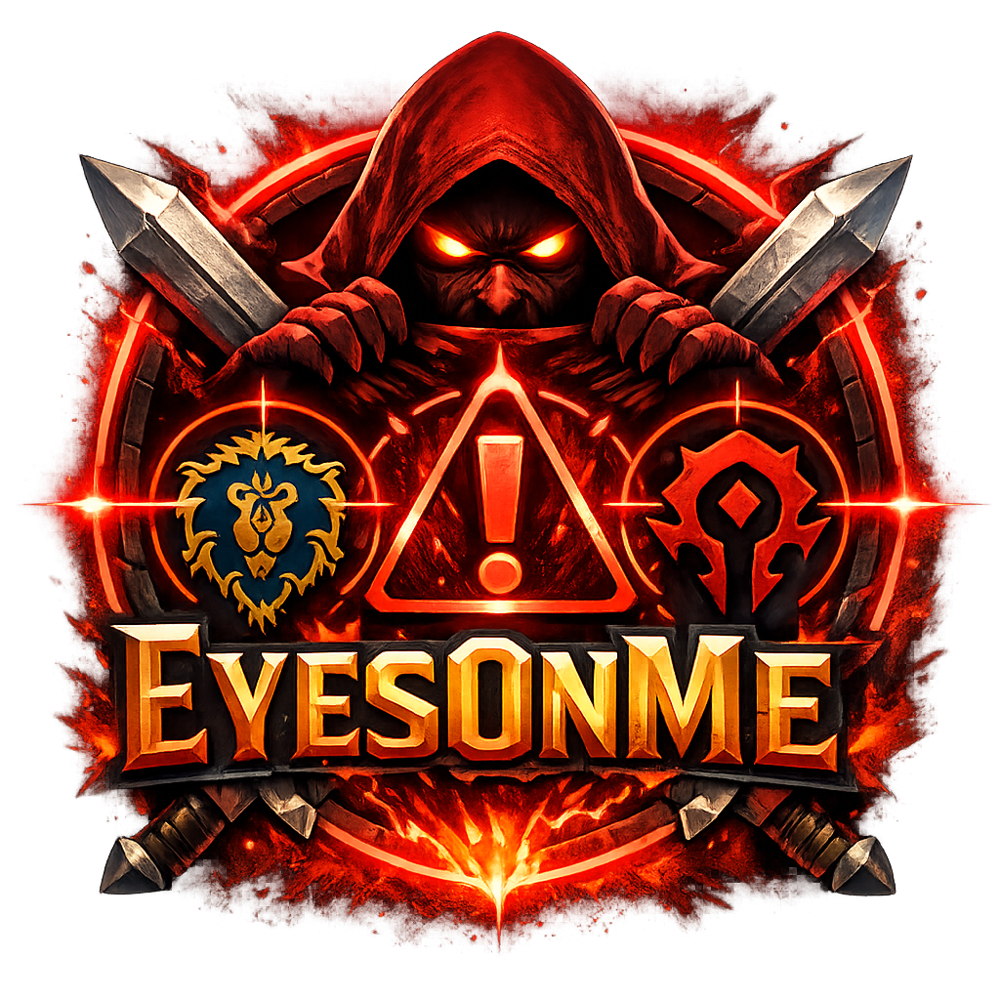

# EyesOnMe

If you find this useful, consider [supporting development](https://www.paypal.com/donate/?hosted_button_id=FG4KES3HNPLVG).

Other addons:
- [LazyProf](https://www.curseforge.com/wow/addons/lazyprof) - Profession leveling optimizer
- [CraftLib](https://www.curseforge.com/wow/addons/craftlib) - Recipe database
- [Silencer](https://www.curseforge.com/wow/addons/silencer-whispers) - Whisper gatekeeper
- [VendorSniper](https://www.curseforge.com/wow/addons/vendorsniper) - Vendor restock sniper
- [PickMe](https://www.curseforge.com/wow/addons/pickme) - LFG listing browser

PvP awareness addon for World of Warcraft Classic. EyesOnMe detects enemy players targeting you by scanning nameplates and alerts you with visual and audio cues.

## Screenshots

## Features

- **Nameplate badges** - Eye icon with red glow appears above enemy nameplates when they target you
- **Friendly tracking** - Teal badges on friendly nameplates when party/raid members target you
- **Red vignette** - Screen-edge red tint that intensifies with the number of threats
- **Threat counter** - Floating, draggable badge showing how many enemies are targeting you (with class-colored tooltip details)
- **Friendly counter** - Separate counter for friendly players targeting you
- **Click-to-target** - Click either counter to open a dropdown and target players directly
- **Sound alerts** - Audio warning when the first enemy starts targeting you
- **Minimap button** - Left-click to toggle, right-click for settings
- **Settings panel** - Toggle each feature independently, adjust vignette intensity

## Installation

1. Download from [CurseForge](https://www.curseforge.com/wow/addons/eyesonme) or [Wago](https://addons.wago.io/addons/eyesonme)
2. Extract to your `Interface/AddOns/` folder
3. Type `/eom` in-game to toggle

## How It Works

EyesOnMe uses a hybrid detection system:
- **Event-driven** - Reacts instantly to `NAME_PLATE_UNIT_ADDED`, `NAME_PLATE_UNIT_REMOVED`, and `UNIT_TARGET` events
- **Polling fallback** - Scans all visible nameplates every 0.5 seconds to catch missed target changes

When an enemy player with a visible nameplate is targeting you, EyesOnMe shows an eye badge on their nameplate, increments the threat counter, and tints your screen edges red.

## Slash Commands

| Command | Description |
|---------|-------------|
| `/eom` | Toggle addon ON/OFF |

## Settings

Right-click the minimap button to open the settings panel:

- Enable/disable addon
- Show/hide nameplate badges
- Show/hide threat counter
- Show/hide red vignette
- Enable/disable sound alerts
- Enable/disable friendly tracking
- Lock counter position
- Vignette intensity slider

## Compatibility

Works on Classic Anniversary Edition (1.15.x) and TBC Classic (2.5.5).

## License

MIT - See [LICENSE](LICENSE) for details.
